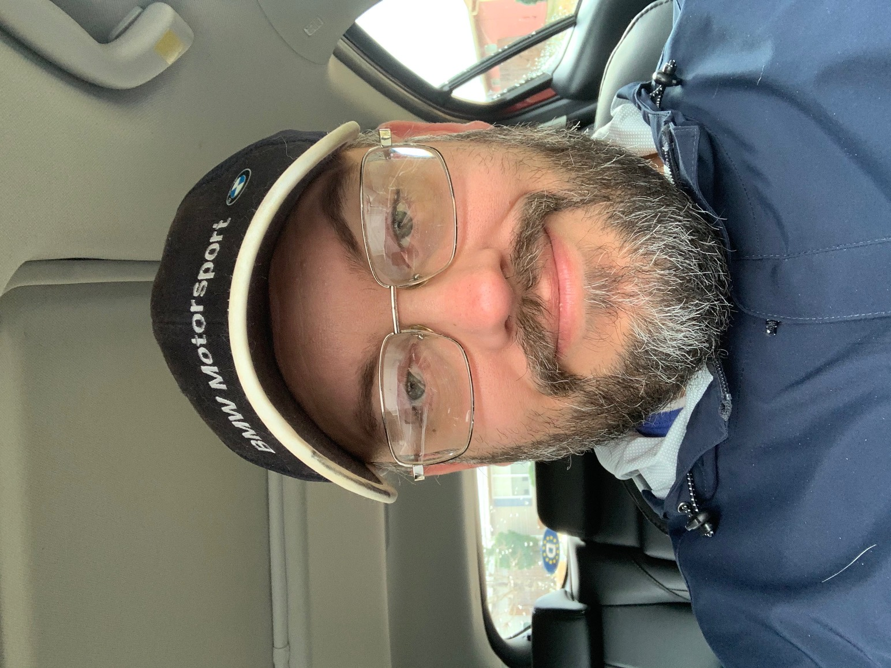

#  My Portfolio Vue3 front

## About Me

## Education

Udacity 2021
Java Nano Degree
Course Work: Gained knowledge in Java

Udemy 2017 - Current
Course Work: Developed skills in PHP, Laravel, MySQL, HTML, CSS, Vue, React, and Java

University of Alabama Huntsville, Alabama Sept 2007 - June 2010
Major: History, M.A.
Course Work: Gained skills in research and public speaking

Montclair State University Montclair, New Jersey Sept 1998 - June 2001
Major: Computer Science, B.S.
Programming Course work: Data Structures & Algorithms, Operating Systems, Networks, Object Oriented Programming, C++, Unix

## Work Experience

Full Stack Web Developer/ Freelancer January 2019 - Present
Full stack Web Developer providing services aimed to help my clients achieve their goals. I also enjoy the challenge of building and improving websites.
Skills: Talking to clients to understand requirements.

Wholefoods Market Huntsville, Alabama November 2016 - Present
Meat/Seafood department
Skills: Customer service, Producing finanical reports for Meat/Seafood department, Ordering for the Seafood department

## Projects

Portfolio Project: I used Vue, Laravel, and MySql.  Laravel API communicated with Vue through Json.

Molly Felder's Author Website

## Skills

I am a full stack software engineer. I have working knowledge in PHP, Lavavel, CSS, Javascript, Vue, HTML, Git/Github, JQuery, and MySQL. I and familiar with Java, React, and Docker.
